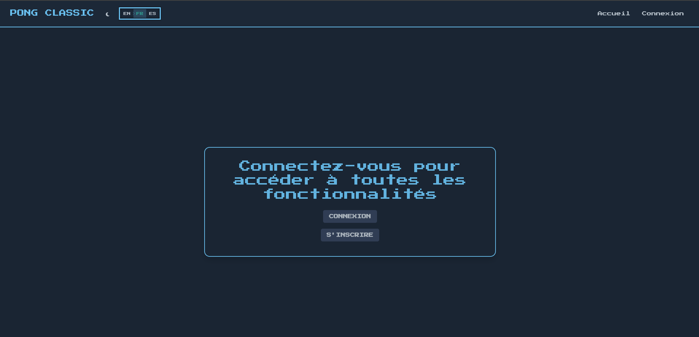
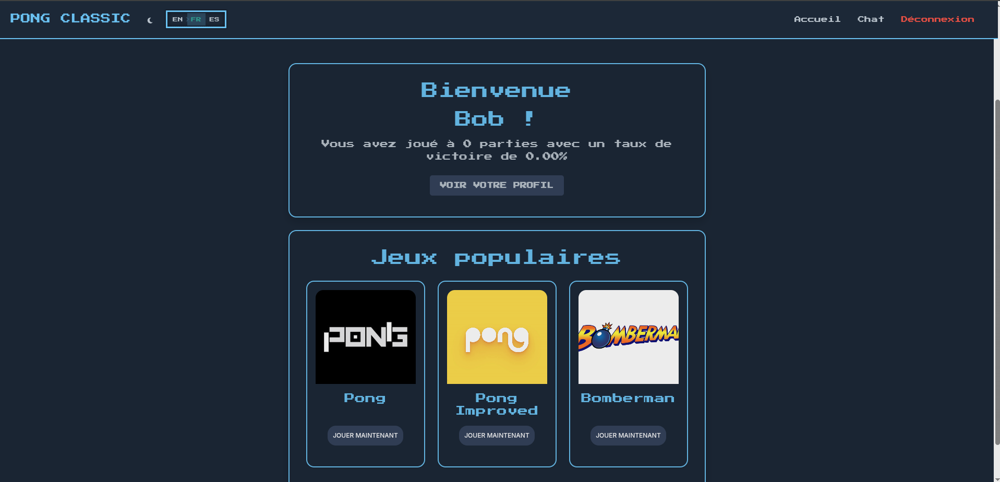
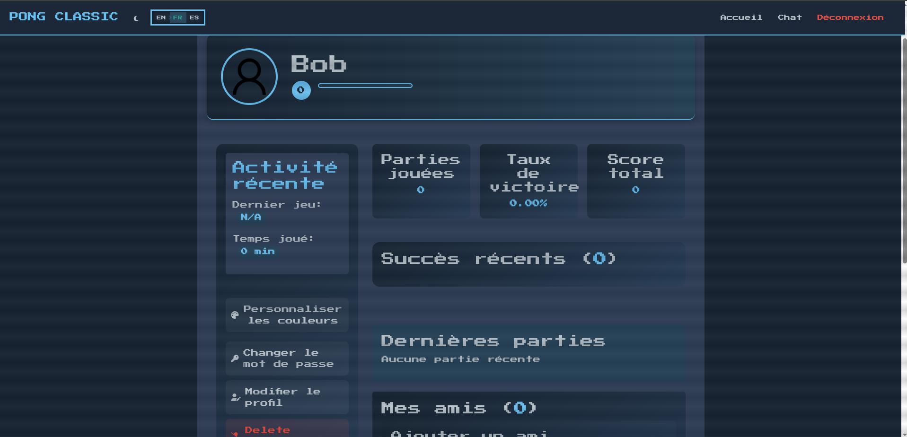
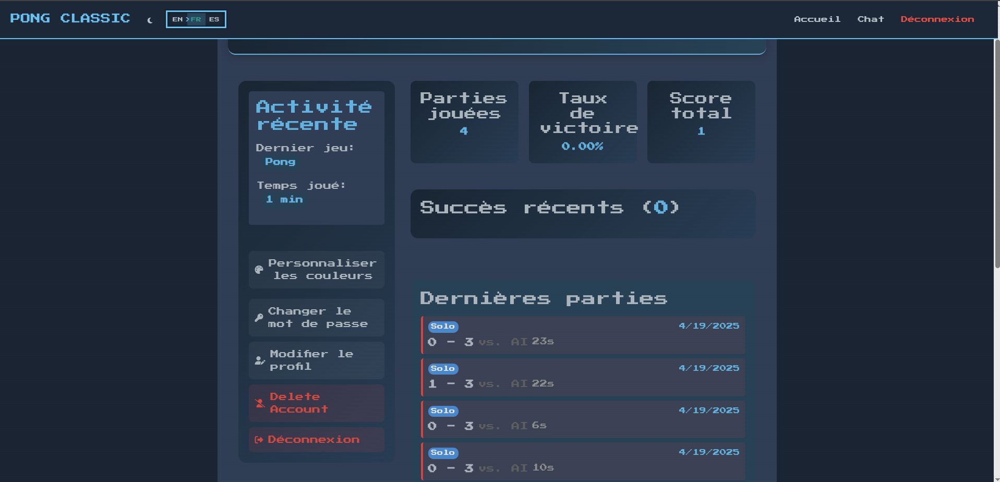
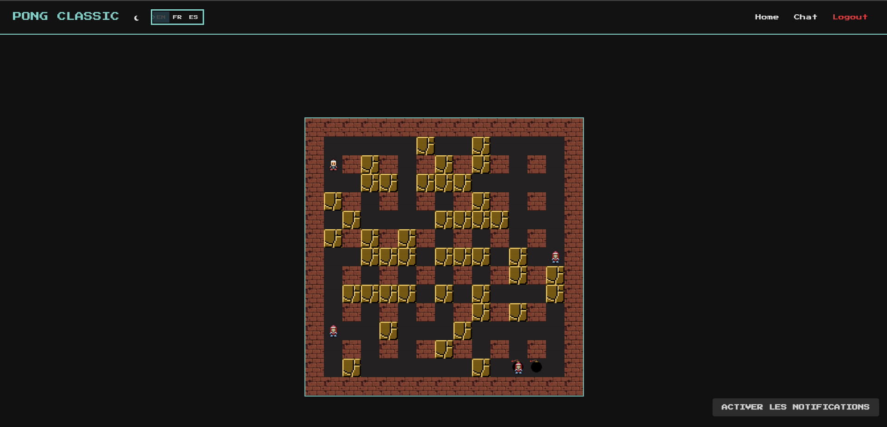
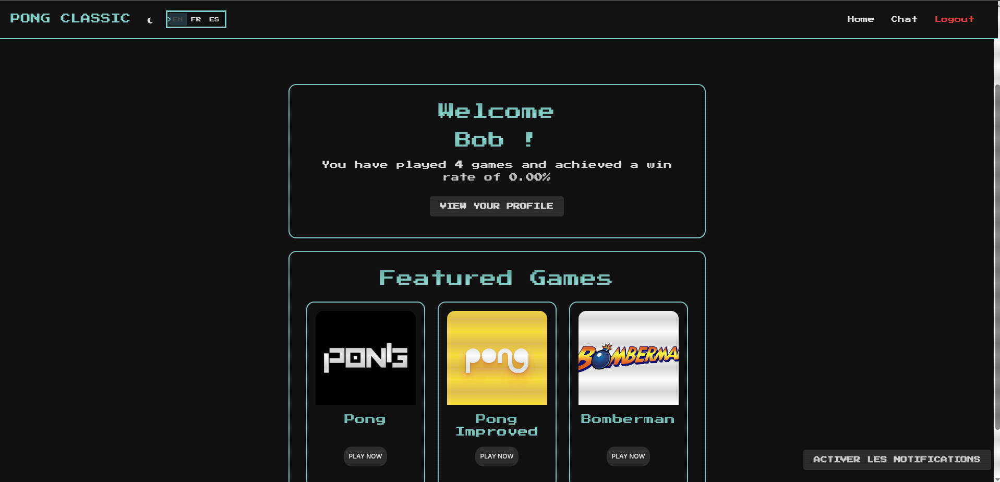
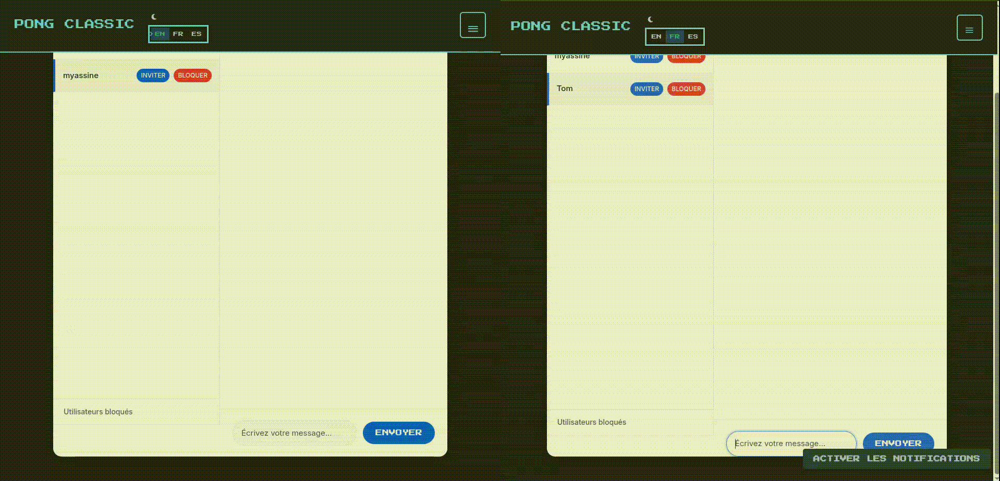
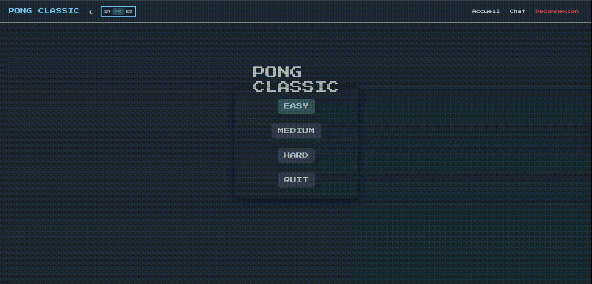
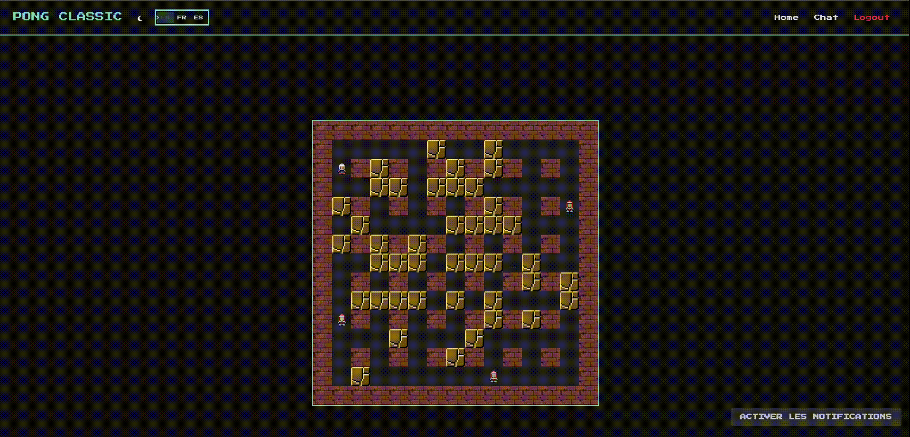

# ft_transcendance

[](https://42.fr)
[]()
[]()
[]()
[]()
[]()


## 📋 Table des matières
- [Description](#-description)
- [Fonctionnalités](#-fonctionnalités)
- [Technologies Utilisées](#️-technologies-utilisées)
- [Captures d'écran](#-captures-décran)
- [Installation](#-installation)
- [Utilisation](#-utilisation)
- [Équipe de développement](#-équipe-de-développement)
- [Défis et Apprentissages](#-défis-et-apprentissages)
- [Ressources](#-ressources)
- [Licence](#-licence)

## 📋 Description

ft_transcendance est une application web développée dans le cadre du cursus 42 qui propose une plateforme de jeux en ligne intégrant une fonctionnalité de chat, un système d'authentification et plusieurs jeux dont Pong et Bomberman jouables en temps réel.

## 🚀 Fonctionnalités

- Interface multilingue (Français, Anglais, Espagnol)
### 🎮 Jeux
- **Pong Classic**: Mode solo avec 3 niveaux de difficulté ou multijoueur
- **Pong Avancé**: Version avec power-ups et fonctionnalités supplémentaires
- **Bomberman**: Jeu d'arcade classique adapté pour le web
- **Tournois**: Système de compétition entre joueurs

### 💬 Système de Chat
- Conversations privées en temps réel

### 👤 Gestion des Utilisateurs
- Authentification via l'API 42
- Profils personnalisables
- Système d'amis
- Statuts en ligne/hors ligne/en jeu

### 🏆 Système de Classement
- Points d'expérience
- Historique des matchs

## 🛠️ Technologies Utilisées

- **Backend**: Django, Django Channels
- **Frontend**: HTML5, CSS3, JavaScript
- **Base de données**: PostgreSQL
- **WebSockets**: Django Channels pour la communication en temps réel
- **Conteneurisation**: Docker, Docker Compose
- **Serveur Web**: Nginx

## 📸 Captures d'écran

<table>
  <tr>
    <td></td>
    <td></td>
    <td></td>
  </tr>
  <tr>
    <td></td>
    <td></td>
    <td></td>
  </tr>
</table>

### 🎬 Démos vidéo

<details>
  <summary>📹 Démonstration du Chat</summary>
  
  <p>Interface de chat en temps réel permettant des conversations privées et de groupe</p>
</details>

<details>
  <summary>📹 Démonstration de Pong</summary>
  
  <p>Jeu de Pong multijoueur avec différents niveaux de difficulté et power-ups</p>
</details>

<details>
  <summary>📹 Démonstration de Bomberman</summary>
  
  <p>Jeu Bomberman avec ses mécaniques classiques adaptées pour le web</p>
</details>


## 🔧 Installation

### Prérequis
- Docker et Docker Compose v2.0+
- Un compte 42 pour l'authentification via 42
- Python 3.9+ (pour le développement local)

### Étapes d'installation

1. Cloner le dépôt
```bash
  git clone https://github.com/BigDataBrothers/ft_transcendance.git
  cd ft_transcendance
  # Activer l'environnement virtuel
  # Sur Linux/macOS
  source venv/bin/activate
  # Sur Windows
  # venv\Scripts\activate
```

2. Configurer les variables d'environnement
```bash
  cd srcs  # Si vous n'y êtes pas déjà
  cp .env.example .env
  # Modifier le fichier .env avec vos informations
```
   
   #### Configuration détaillée du fichier .env
   
   ```
   # Configuration de l'API 42 OAuth
   FT_CLIENT_ID=votre_client_id_42
   FT_CLIENT_SECRET=votre_client_secret_42
   FT_APP_CALLBACK=https://localhost:8443/api/auth/42/callback
   
   # Configuration de la base de données PostgreSQL
   POSTGRES_DB=postgres
   POSTGRES_USER=postgres
   POSTGRES_PASSWORD=postgres
   POSTGRES_HOST=db
   POSTGRES_PORT=5432
   
   # Configuration du serveur
   SECRET_KEY=votre_clé_secrète_django
   DEBUG=False
   ALLOWED_HOSTS=localhost,127.0.0.1
   
   # Configuration de Nginx
   NGINX_PORT=8443
   DOMAIN_NAME=localhost
   
   # Configuration optionnelle pour le développement
   # EMAIL_HOST=smtp.example.com
   # EMAIL_PORT=587
   # EMAIL_USE_TLS=True
   # EMAIL_HOST_USER=votre_email@example.com
   # EMAIL_HOST_PASSWORD=votre_mot_de_passe_email
   ```
   
   Pour obtenir vos identifiants OAuth 42:
1. Connectez-vous sur le site [42 Intranet](https://profile.intra.42.fr/)
2. Accédez à vos paramètres → API
3. Créez une nouvelle application
4. Pour l'URI de redirection, utilisez `https://localhost:8443/api/auth/42/callback`
5. Notez votre Client ID et Client Secret et ajoutez-les à votre fichier .env

3. Générer les certificats SSL
```bash
   cd srcs/scripts
   ./generate_certs.sh
   cd ..
   # Vérifier que les certificats ont été créés
   ls -la certs/
```

4. Lancer les conteneurs Docker
```bash
   cd srcs  # Si vous n'y êtes pas déjà
   docker-compose up -d
```

5. Accéder à l'application
```
   https://localhost:8443
```

## 📖 Utilisation

### Création de compte / Connexion
- Créez un compte directement sur la plateforme
- Ou connectez-vous via l'authentification OAuth 42

### Navigation dans l'application
- **Profil**: Personnalisez votre profil, modifiez vos informations
- **Chat**: Communiquez avec d'autres utilisateurs
- **Jeux**: Accédez à Pong et Bomberman
- **Tournois**: Participez à des compétitions

### Jouer à Pong
- Rejoignez la salle d'attente ou invitez un ami
- Utilisez les touches ↑ et ↓ ou w et s pour contrôler votre raquette

### Jouer à Bomberman
- Créez une nouvelle partie
- Utilisez les touches directionnelles pour vous déplacer et la barre d'espace pour poser une bombe

### Utiliser le Chat
- Créez un salon de discussion ou rejoignez-en un existant
- Envoyez des messages privés à vos amis

## 👨‍💻 Équipe de développement
- Mehdi Yassine - Chef de projet et architecte
- [Ajoutez d'autres membres si nécessaire]

## 🔍 Défis et Apprentissages
- Mise en place de communication en temps réel avec WebSockets
- Développement de jeux multijoueurs avec gestion de la latence
- Sécurisation des échanges et authentification via OAuth
- Organisation du code pour une application web complexe
- Adaptation des principes de jeux classiques à une architecture moderne web

## 🔧 Débogage et problèmes courants

### Port déjà utilisé
```bash
# Vérifier les ports utilisés
sudo lsof -i :8443
# Arrêter le processus
sudo kill -9 [PID]
```

### Erreur d'authentification OAuth
1. Vérifiez que vos identifiants sont correctement configurés dans le fichier .env
2. Assurez-vous que l'URI de redirection est exactement celle configurée sur le portail 42
3. Vérifiez les journaux Docker pour plus de détails:
   ```bash
   docker-compose logs -f web
   ```

## 📚 Ressources
- [Documentation Django](https://docs.djangoproject.com/)
- [Documentation Django Channels](https://channels.readthedocs.io/)
- [Documentation API 42](https://api.intra.42.fr/apidoc)
- [Guide WebSockets](https://developer.mozilla.org/fr/docs/Web/API/WebSockets_API)

## 🙏 Remerciements
- École 42 pour l'opportunité de développer ce projet
- La communauté open-source pour les nombreuses ressources et inspirations

## 📝 Licence
Ce projet a été réalisé dans le cadre du cursus de l'école 42 et est sous licence MIT.

---

<div align="center">
  <p>Développé avec ❤️ par l'équipe ft_transcendance</p>
  <p>© 2025 École 42</p>
</div>
